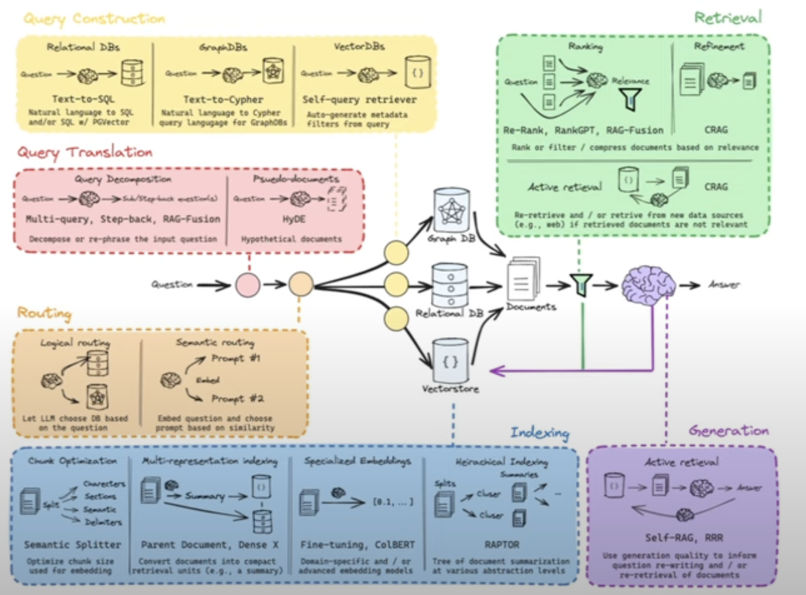

1. **Query Construction**: This phase involves transforming the input question into a format that can be understood by various types of databases. It includes converting natural language questions into SQL for relational databases, Cypher for graph databases, or forming a query for vector databases.
   - Text-to-SQL: Converting natural language to SQL for querying relational databases.
   - Text-to-Cypher: Transforming natural language into Cypher queries for graph databases.
   - Self-query retriever: A system to create metadata filters directly from the query for vector databases.

2. **Query Translation**: This step deals with modifying the original query to improve retrieval. It may involve decomposing the question into subqueries or creating pseudo-documents that represent hypothetical documents that might contain the answer.
   - Query Decomposition: Breaking down complex questions into simpler sub-queries.
   - Pseudo-documents: Generating hypothetical document structures that might contain the answer.

3. **Routing**: In this stage, the question is directed to the most relevant information source or processing path. This could involve logical routing, which selects the database type based on the question, or semantic routing, which chooses a path based on the semantic similarity of the question to known prompts.
   - Logical Routing: Selecting the appropriate database type based on the question.
   - Semantic Routing: Choosing a processing path based on the semantic similarity of the question to known prompts.

4. **Indexing**: This component organizes and optimizes the storage of information to make retrieval more efficient. It can include chunk optimization to determine the best way to divide documents into searchable parts, multi-representation indexing to create compact retrieval units, specialized embeddings to create domain-specific search vectors, and hierarchical indexing to create a summary tree for documents.
   - Chunk Optimization: Dividing documents into searchable units based on characters, sections, sentences, or delimiters.
   - Multi-representation indexing: Converting documents into compact retrieval units like summaries.
   - Specialized Embeddings: Domain-specific or advanced embedding models for indexing.
   - Hierarchical Indexing: Creating a tree of document summarization at various abstraction levels.

5. **Retrieval**: The actual process of fetching relevant documents or data from the databases or storage systems based on the processed query. This includes ranking documents by relevance to the question and refining the retrieval through methods like re-ranking or active retrieval, which may involve going back to the data source for more information if the initial retrieval is not relevant enough.
   - Ranking: Ordering documents by relevance to the question.
   - Re-Rank, RankGPT, RAG-Fusion: Methods for re-ranking or filtering documents.
   - Active retrieval: If initial documents are not relevant, re-retrieve or fetch new data.

6. **Generation**: The final phase where the retrieved information is used to generate an answer. This can involve active retrieval, where the generation process informs further retrieval of documents, and self-RAG or Aided Re-Ranking and Re-Retrieval (ARRR), which are methods that use the quality of the generated answer to improve upon the documents that are retrieved.
   - Active Retrieval: Using the generation process to inform further retrieval.
   - Self-RAG, ARR: Utilizing generation quality to refine question re-writing and document retrieval.
